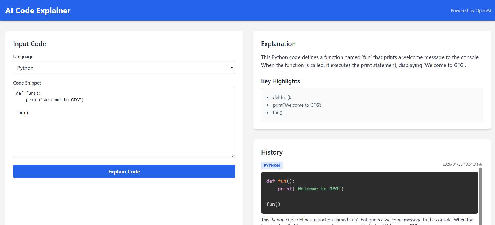

# AI-Powered Code Explainer

## Objective
A web-based tool that takes a code snippet (Python or JavaScript) as input and outputs a plain-English explanation of what the code does, powered by OpenAI.

## System Architecture & Technical Decisions

### Architecture
- **Frontend**: HTML5, CSS3 (Tailwind CSS), Vanilla JavaScript.
    - **Reasoning**: Lightweight, no build step required (using CDNs), fast development for MVP.
- **Backend**: PHP 8.x.
    - **Reasoning**: Chosen language for the assignment. Simple, widely supported, and easy to deploy.
- **AI Integration**: OpenAI API (GPT-4o-mini).
    - **Reasoning**: Reliable, cost-effective, and provides high-quality code explanations.
- **State Management**: PHP Sessions.
    - **Reasoning**: To store the history of queries without needing a database for this MVP.

### Dependencies
- `guzzlehttp/guzzle`: For making robust HTTP requests to the OpenAI API.
- `vlucas/phpdotenv`: For secure environment variable management (API keys).
- `Prism.js`: For syntax highlighting on the frontend.
- `Tailwind CSS`: For rapid UI development.

## AI Tool Selection
I selected **OpenAI's GPT-4o-mini** for this project.
- **Accuracy**: It excels at code understanding and natural language generation.
- **Speed**: It offers a good balance between response time and quality for interactive web apps.
- **Ease of Use**: The API is well-documented and easy to integrate with PHP.

## Handling Hallucinations & Accuracy
To minimize hallucinations:
- **Prompt Engineering**: The system prompt explicitly instructs the AI to be "concise (2-4 sentences)" and focused on "plain English explanation".
- **Context**: The prompt clearly wraps the user's code in markdown code blocks to delineate it from instructions.
- **Future Improvements**:
    - Implement a validation step where a second AI call verifies the explanation against the code.
    - Use a more advanced model (GPT-4) for complex snippets.
    - Static Analysis (AST) could be used to extract function names/signatures to cross-verify the AI's explanation.

## Setup Instructions

### Prerequisites
- PHP 8.0 or higher
- Composer

### Installation
1. **Clone the repository**:
   ```bash
   git clone <repository-url>
   cd <project-directory>
   ```

2. **Install Dependencies**:
   ```bash
   composer install
   ```

3. **Configure Environment**:
   - Copy `.env.example` to `.env`:
     ```bash
     cp .env.example .env
     ```
   - Open `.env` and add your OpenAI API Key:
     ```
     OPENAI_API_KEY=sk-...
     ```

4. **Run the Application**:
   - You can use PHP's built-in server for testing:
     ```bash
     cd public
     php -S localhost:8000
     ```
   - Open your browser and navigate to `http://localhost:8000`.

## Usage
1. Select the language (Python or JavaScript).
2. Paste your code snippet into the text area.
3. Click "Explain Code".
4. The explanation will appear on the right, and the query will be saved to your session history.

